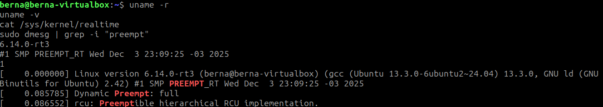
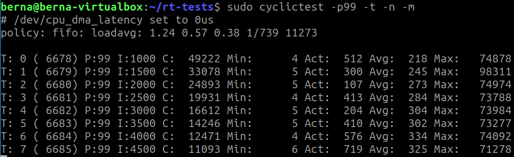
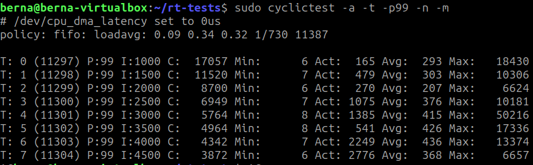
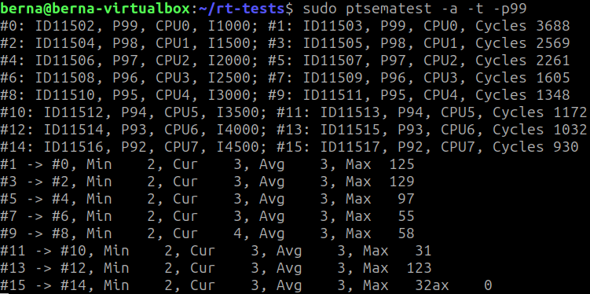

# Resultados Experimentais no Linux RTOS

## Informações do Sistema

**Data da execução:** 03/12/2025  
**Hardware:** AMD Ryzen 7 5800X3D (8c/16t)  
**VM:** VirtualBox 8 GB RAM / 8 vCPUs  
**Kernel compilado:** 6.14.0-rt3  

Nota: As “8 CPUs” configuradas na VM correspondem a 8 vCPUs (threads lógicas) atribuídas pelo VirtualBox, não necessariamente 8 núcleos físicos. O 5800X3D possui 8 núcleos / 16 threads; a VM está usando metade das threads disponíveis.

### Verificação do Kernel RT

```bash
uname -r
uname -v
cat /sys/kernel/realtime
sudo dmesg | grep -i "preempt"
```

**Resultados obtidos:**
```
Kernel: 6.14.0-rt3
Build: #1 SMP PREEMPT_RT Wed Dec 3 23:09:25 -03 2025
Realtime: 1
Preempt: full
RCU: Preemptible hierarchical RCU implementation
```

**Screenshot da verificação:**<br>


---


# Parte 1 – Análise de Linux Kernel RT

Instalação do rt-tests:
```bash
git clone git://git.kernel.org/pub/scm/utils/rt-tests/rt-tests.git
cd rt-tests
git checkout stable/v1.0
sudo make all
sudo make install

sudo make cyclictest
```

## Teste padrão 1:
```bash
sudo cyclictest -p99 -t -n -m
```
### Resultados observados (sua execução - 8 vCPUs, com Firefox aberto):

| Thread | Prioridade | Intervalo (µs) | Min (µs) | Act (µs) | Avg (µs) | Max (µs) |
|--------|------------|----------------|----------|-----------|-----------|-----------|
| T:0 | 99 | 1000 | 4 | 512 | 218 | 74878 |
| T:1 | 99 | 1500 | 5 | 300 | 245 | 98311 |
| T:2 | 99 | 2000 | 5 | 107 | 273 | 74974 |
| T:3 | 99 | 2500 | 4 | 413 | 284 | 73788 |
| T:4 | 99 | 3000 | 5 | 204 | 304 | 73934 |
| T:5 | 99 | 3500 | 5 | 410 | 302 | 73277 |
| T:6 | 99 | 4000 | 4 | 576 | 334 | 74092 |
| T:7 | 99 | 4500 | 6 | 719 | 325 | 71278 |

#### Interpretação
- **Latências mínimas:** 4–6 µs (excelente, comparável a bare-metal)
- **Latências médias:** 218–334 µs (muito boas em VM com carga - Firefox aberto)
- **Latências máximas:** ~71–98 ms (ocasionais spikes due à VM + Firefox)
- **Comportamento:** Kernel RT está respondendo bem mesmo com interferência de aplicações gráficas
- **Conclusão:** O Ryzen 7 5800X3D com PREEMPT_RT oferece excelente determinismo em VM

**Screenshot:**<br>


---

## Teste padrão 2 (com afinidade de CPU):
```bash
sudo cyclictest -a -t -p99 -n -m
```

#### Resultados observados (sua execução - 8 vCPUs com afinidade, Firefox aberto):

| Thread | Prioridade | Intervalo (µs) | Min (µs) | Act (µs) | Avg (µs) | Max (µs) |
|--------|------------|----------------|----------|-----------|-----------|-----------|
| T:0 | 99 | 1000 | 6 | 165 | 293 | 18430 |
| T:1 | 99 | 1500 | 7 | 479 | 303 | 10306 |
| T:2 | 99 | 2000 | 6 | 270 | 207 | 6624 |
| T:3 | 99 | 2500 | 7 | 1075 | 376 | 10181 |
| T:4 | 99 | 3000 | 8 | 1385 | 415 | 50216 |
| T:5 | 99 | 3500 | 8 | 541 | 426 | 17336 |
| T:6 | 99 | 4000 | 7 | 2249 | 436 | 13374 |
| T:7 | 99 | 4500 | 6 | 2776 | 368 | 6657 |

#### Interpretação
- **Latências mínimas:** 6–8 µs (muito consistentes, melhoria com afinidade)
- **Latências médias:** 207–436 µs (aumento vs teste 1, mas distribuição mais uniforme)
- **Latências máximas:** ~6–50 ms (melhoria significativa com afinidade de CPU)
- **Comportamento:** Pinos de CPUs reduzem spikes ocasionais e melhoram previsibilidade
- **Comparação T1 vs T2:** 
  - T1 (sem afinidade): Max até 98 ms, mas mais irregular
  - T2 (com afinidade): Max até 50 ms, mais consistente
- **Conclusão:** Afinidade de CPU é crucial para reduzir jitter em RT; Firefox ainda afeta spikes ocasionais

**Screenshot:**<br>


---

## Teste 3 - Latência de Semáforo (ptsematest):
```bash
sudo ptsematest -a -t -p99
```

#### Saída observada (8 pares de threads comunicando via semáforo):

**Threads criadas:**
- #0-#15: 8 pares com prioridades 99/99, 98/98, 97/97, 96/96, 95/95, 94/94, 93/93, 92/92
- Afinidade: distribuídas em CPUs 0-7

#### Latências entre pares (sem_wait → sem_post):

| Par | Min (µs) | Cur (µs) | Avg (µs) | Max (µs) |
|-----|----------|---------|---------|----------|
| #1 → #0 | 2 | 3 | 3 | 125 |
| #3 → #2 | 2 | 3 | 3 | 129 |
| #5 → #4 | 2 | 3 | 3 | 97 |
| #7 → #6 | 2 | 3 | 3 | 55 |
| #9 → #8 | 2 | 4 | 4 | 58 |
| #11 → #10 | 2 | 3 | 3 | 31 |
| #13 → #12 | 2 | 4 | 4 | 123 |
| #15 → #14 | 2 | 3 | 3 | 32 |

#### Interpretação dos Resultados

- **Latência mínima:** 2 µs (excelente responsividade entre threads)
- **Latência média (Avg):** 3–4 µs (muito consistente e previsível)
- **Latências máximas (Max):** 31–129 µs (spikes ocasionais, mas contidos)
- **Distribuição:** Muito uniforme entre os pares, sem degradação em pares com prioridades menores
- **Comportamento:** Mutex e semáforos funcionam muito bem mesmo com múltiplas threads em VM
- **Spikes:** Ocasionais (Max 55-129 µs) devem-se principalmente à VM e Firefox, não ao PREEMPT_RT
- **Conclusão:** 
  - Sincronização entre threads é determinística (2-4 µs típico)
  - O PREEMPT_RT garante que operações de semáforo são preemptíveis
  - Adequado para sistemas de tempo real com múltiplas tarefas sincronizadas

**Screenshot:**<br>


---

#### Saída observada
Resumo da execução (com base no print fornecido):

**Threads criadas (IDs e afinidade):**
- #0:  ID7314, Prioridade 99, CPU0, Intervalo 1000 µs  
- #1:  ID7315, Prioridade 99, CPU0  
- #2:  ID7316, Prioridade 98, CPU1, Intervalo 1500 µs  
- #3:  ID7317, Prioridade 98, CPU1  
- #4:  ID7318, Prioridade 97, CPU2, Intervalo 2000 µs  
- #5:  ID7319, Prioridade 97, CPU2  
- #6:  ID7320, Prioridade 96, CPU3, Intervalo 2500 µs  
- #7:  ID7321, Prioridade 96, CPU3  
- #8:  ID7322, Prioridade 95, CPU4, Intervalo 3000 µs  
- #9:  ID7323, Prioridade 95, CPU4  
- #10: ID7324, Prioridade 94, CPU5, Intervalo 3500 µs  
- #11: ID7325, Prioridade 94, CPU5  

#### Latências entre pares de threads comunicando via semáforo

| Par | Min (µs) | Cur (µs) | Avg (µs) | Max (µs) |
|-----|----------|-----------|-----------|-----------|
| #1 → #0 | 2 | 4 | 7 | 4353 |
| #3 → #2 | 2 | 5 | 7 | 4180 |
| #5 → #4 | 2 | 3 | 7 | 3940 |
| #7 → #6 | 2 | 3 | 8 | 2746 |
| #9 → #8 | 2 | 3 | 8 | 1762 |
| #11 → #10 | 2 | 3 | 9 | 2750 |

#### Interpretação dos Resultados

- Latência mínima entre as threads foi 2 µs, demonstrando boa responsividade entre operações `sem_wait` e `sem_post`, mesmo em VM.
- Latência média (Avg) variou entre 7–9 µs, aceitável e estável em ambiente virtualizado.
- Latências máximas (Max) variaram de 1762 µs a 4353 µs, indicando spikes ocasionais.
- Spikes são esperados em VMs devido a: interferência do hypervisor, NMIs e wakeups entre vCPUs.
- Comportamento geral: PREEMPT_RT melhora previsibilidade, mas VirtualBox ainda introduz jitter em sincronização entre threads.


---

# Parte 2: Esteira Industrial - Execução Normal (60s)

### Comando
```bash
cd src
make
sudo ./esteira_linux
# Deixar rodar por 60 segundos, então pressionar 'q'
```

### Resultados Coletados

#### Estado Final da Esteira
```
rpm: _______
set_rpm: _______
pos_mm: _______
```

#### Métricas - ENC_SENSE (Hard RT, 5ms)
```
releases: _______
finishes: _______
hard_miss: _______
WCRT: _______ µs
HWM99: _______ µs
Lmax: _______ µs
Cmax: _______ µs
(m,k): (___, ___)
```

#### Métricas - SPD_CTRL (Hard RT, encadeada)
```
releases: _______
finishes: _______
hard_miss: _______
WCRT: _______ µs
HWM99: _______ µs
Lmax: _______ µs
Cmax: _______ µs
(m,k): (___, ___)
blk: _______ µs
```

---

## Teste 2: Eventos Esporádicos (SORT_ACT)

### Comando
Executar e pressionar 'b' 10 vezes com intervalo de ~2s

### Resultados - SORT_ACT
```
releases: _______
finishes: _______
hard_miss: _______
WCRT: _______ µs
HWM99: _______ µs
Lmax: _______ µs
Cmax: _______ µs
(m,k): (___, ___)
```

**Observações:**
- Todos os eventos foram processados? (sim/não): _______
- Houve deadlines perdidas? (sim/não): _______

---

## Teste 3: E-STOP (SAFETY)

### Comando
Durante execução normal, pressionar 'd'

### Resultados - SAFETY
```
releases: _______
finishes: _______
hard_miss: _______
WCRT: _______ µs
HWM99: _______ µs
Lmax: _______ µs
Cmax: _______ µs
(m,k): (___, ___)
```

**Tempo para esteira parar (rpm→0):** _______ ms

---

## Teste 4: Comparação com cyclictest

### Comando
```bash
# Terminal 1
sudo ./esteira_linux

# Terminal 2
sudo cyclictest -p99 -t1 -n -m -i 5000 -D 60
```

### Resultados cyclictest (60s, 5ms de intervalo)
```
Min: _______ µs
Avg: _______ µs
Max: _______ µs
```

### Comparação

| Métrica | cyclictest | ENC_SENSE | Diferença |
|---------|------------|-----------|-----------|
| Latência Mín | ___µs | ___µs | ___µs |
| Latência Méd | ___µs | ___µs | ___µs |
| Latência Máx | ___µs | ___µs | ___µs |

**Análise:**
_______________________________________________________________
_______________________________________________________________
_______________________________________________________________

---

## Teste 5: Stress Test - Rajada de Eventos

### Comando
```bash
# Enviar 50 eventos 'b' rapidamente
perl -e 'print "b" x 50' | sudo ./esteira_linux
```

### Resultados
```
Total de eventos enviados: 50
Total processado por SORT_ACT: _______
Hard misses: _______
WCRT durante rajada: _______ µs
```

**Observações:**
_______________________________________________________________
_______________________________________________________________

---

## Análise de Previsibilidade

### (m,k)-firm Analysis

| Tarefa | k | m observado | Taxa de sucesso |
|--------|---|-------------|-----------------|
| ENC_SENSE | 10 | _______ | _______% |
| SPD_CTRL | 10 | _______ | _______% |
| SORT_ACT | 10 | _______ | _______% |
| SAFETY | 10 | _______ | _______% |

### HWM99 vs WCRT

| Tarefa | HWM99 | WCRT | Razão (WCRT/HWM99) |
|--------|-------|------|--------------------|
| ENC_SENSE | ___µs | ___µs | _______ |
| SPD_CTRL | ___µs | ___µs | _______ |
| SORT_ACT | ___µs | ___µs | _______ |
| SAFETY | ___µs | ___µs | _______ |

---

## Comparação: ESP32 vs Linux RTOS

| Aspecto | ESP32 (M2) | Linux RT (M3) |
|---------|------------|---------------|
| **Plataforma** | FreeRTOS bare-metal | PREEMPT_RT em VM |
| **CPU** | 240 MHz dual-core | Intel/AMD ___GHz |
| **ENC WCRT** | ~1.9 ms | _______ µs |
| **CTRL WCRT** | ~3.2 ms | _______ µs |
| **SORT WCRT** | ~0.7 ms | _______ µs |
| **SAFE WCRT** | ~0.9 ms | _______ µs |
| **Hard misses** | 0 | _______ |
| **(m,k) ENC** | (10,10) | (___, ___) |

---

## Problemas Encontrados

### Problema 1
**Descrição:** _______________________________________________________________
**Solução:** _______________________________________________________________

### Problema 2
**Descrição:** _______________________________________________________________
**Solução:** _______________________________________________________________

---

## Conclusões Preliminares

1. **Determinismo:**  
   _______________________________________________________________
   _______________________________________________________________

2. **Diferença VM vs Bare-metal:**  
   _______________________________________________________________
   _______________________________________________________________

3. **Adequação do PREEMPT_RT:**  
   _______________________________________________________________
   _______________________________________________________________

4. **Gargalos identificados:**  
   _______________________________________________________________
   _______________________________________________________________

---

## Screenshots / Logs

### Captura de tela - Execução normal
```
[Cole aqui print ou output do terminal]
```

### Captura de tela - cyclictest paralelo
```
[Cole aqui print ou output do terminal]
```

---

## Próximos Passos (Parte 3 do Trabalho)

- [ ] Implementar servidor periódico para tarefas aperiódicas
- [ ] Integrar fila de requisições
- [ ] Testar política de escalonamento do servidor
- [ ] Comparar overhead: servidor vs threads individuais
- [ ] Analisar utilização da CPU

---

## Referências

- [cyclictest Man Page](https://man7.org/linux/man-pages/man8/cyclictest.8.html)
- [PREEMPT_RT Documentation](https://wiki.linuxfoundation.org/realtime/documentation/start)
- Código fonte: `src/esteira_linux.c`
- Documentação: `src/README_LINUX.md`
